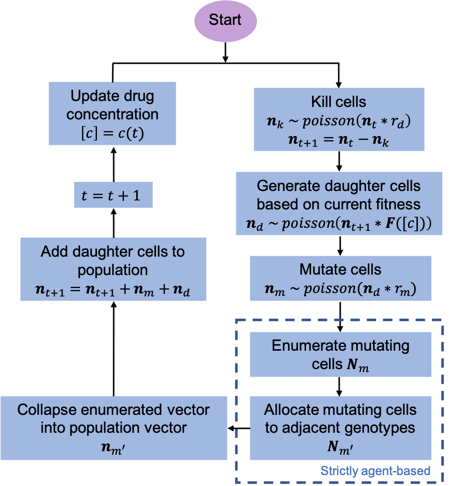

# Summary

The evolution of drug resistance across kingdoms, including in cancer and 
infectious disease, is governed by the same fundamental laws. Modeling 
evolution with genotype-specific dose response curves, collectively forming a
'fitness seascape', enables simulations that include realistic pharmacokinetic 
constraints, more closely resembling the environmental conditions within a 
patient [@Merrell:1994;@Mustonen:2009;@King:2022;@Agarwala:2019]. FEArS (Fast Evolution on Arbitrary Seascapes) is a python package
that enables simulating evolution with fitness seascapes. FEArS can simulate a 
wide variety of experimental conditions with many arbitrary biological 
parameters. FEArS remains computationally efficient despite being an 
agent-based model, even for very large population sizes. FEArS also contains 
powerful and flexible utilities for data analysis, plotting, and experimental
fitness seascape estimation. 

The two core classes for simulating populations and running experiments are 
Population and Experiment, respectively. The Population class includes all
biological parameters relevant for the evolving population under study in 
addition to methods for simulating evolution. The Experiment class includes
parameters for running an experiment with multiple populations, including 
varying pharmacokinetic parameters, number of simulations, and results saving
methods.

## A hybrid agent-based algorithm

FEArS achieves fast runtimes while simulating large populations of evolving
agents by employing what we term a 'hybrid agent-based' approach. When 
possible, populations are stored as vectors of cell numbers $\hat n$, where each 
position in the vector corresponds to a genotype and the number at that 
position gives the number of cells of that type in the population. Then, 
stochastic events such as cell division and cell death are simply drawn from 
poission distributions:

\begin{equation}\label{eq:cell_death}
  \hat n_{d} \sim poisson(r_{d}*\hat n),
\end{equation}

where $\hat n_{d}$ refers to the vector of dead cells of each type, for example.
However, in the mutation step, FEArS switches to a strictly agent-based process.
Here, every mutating agent is enumerated in a vector, where each entry in the 
vector represents the genotype of the agent. Then, mutating agents are randomly
allocated to adjacent genotypes (\autoref{fig:flowchart}). Since the number
of mutating cells is much smaller than the total population size (i.e., with a 
mutation rate on the order of $10^{-6}$ to $10^{-9}$ per base pair), this 
agent-based step does not compromise computational efficiency.

{ width=70% }

By modeling realistic population sizes, FEArS enables investigation of 
population extinction and stochastic evolutionary rescue.

## A suite of useful utilies

In addition to the core population and experiment classes, FEArS includes 
utilities to assist with computational experiments, empirical data analysis, 
and results visualization.

- plotter: a broad and flexible plotting utility, including functions for plotting
evolutionary dynamics timetraces, Kaplan-Meier curves, and fitness landscapes.

- pharm: functions for pharmacokinetics, including generating arbitrary 
pharmacokinetic curves and simulating patient nonadherence.

- fitness: functions for pharmacodynamics, including computing fitness landscapes
and fitness seascapes.

- AutoRate: classes and methods for estimating fitness seascapes from 
experimental data.

![Example FEArS functionality. A: Empirical fitness seascape in transgenic yeast (data adapted from [@Ogbunugafor:2016]). B: Example evolutionary timetrace for a population experiencing a drug concentration curve given by the black line. Colors indicate the genotype corresponding to A. C: Example fitness landcsape generated from A a $10^{0}$ ug/mL drug concentration. D: Example time-to-event curve generated from evolutionary simulations of patient nonadherence (adapted from [@King:2022]).](joss_example_fig.png){ width=70% }

# Statement of need

FEArS enables stochastic simulations of clonally evolving systems 
subject to arbitrary drug concentrations over time. By using an agent-based
algorithm, we are able to model mutation and selection, with evolution arising 
as an emergent phenomena. Furthermore, by allowing for arbitrary population 
sizes, FEArS can model population extinction. Arbitrary population sizes allows
us to simulate how a disease population within a patient may respond to 
therapy. In addition, FEArS models genotype-sprecific dose-response curves, 
allowing for more fine-grained prediction of evolution.

Other common evolutionary simulation approaches are Moran processes [@Moran:1958] 
and Wright-Fisher models [@Wright:1931; @Fisher:1930]. However, both 
approaches have limitations that preclude modeling evolutionary dynamics in a
wide variety of settings, including with varying population size and varying drug concentration.
Other software for simulating evolution with fitness landcsapes utilize Markov
chains, which achieve extremely high computational efficiency but cannot model
arbitrary population sizes and time-varying selection [@Maltas:2021;@Nichol:2015].
In addition, there exists a suite of software packages for simulating tumor evolution
[@McDonald:2017;@Irurzun-Arana:2020;@Roney:2020;@Angaroni:2022]. However, these packages
either do not model drug pharmacokinetics and pharmacodynamics, do not model 
genotype-specific dose-response curves, or are simply more suited for studying
spatial tumor evolution (in contrast to well-mixed pathogen populations that FEArS
is suited for). To our knowledge, there is no open-source software that permits 
stochastic evolutionary simulations with empirical genotype-specific dose-response 
curves and arbitrary drug pharmacokinetics. To date, FEArS has been used extensively 
in one manuscript [@King:2022].

# Acknowledgements

# References